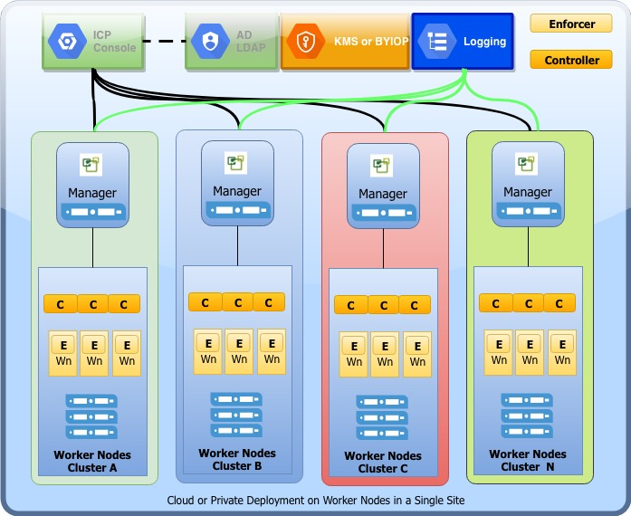
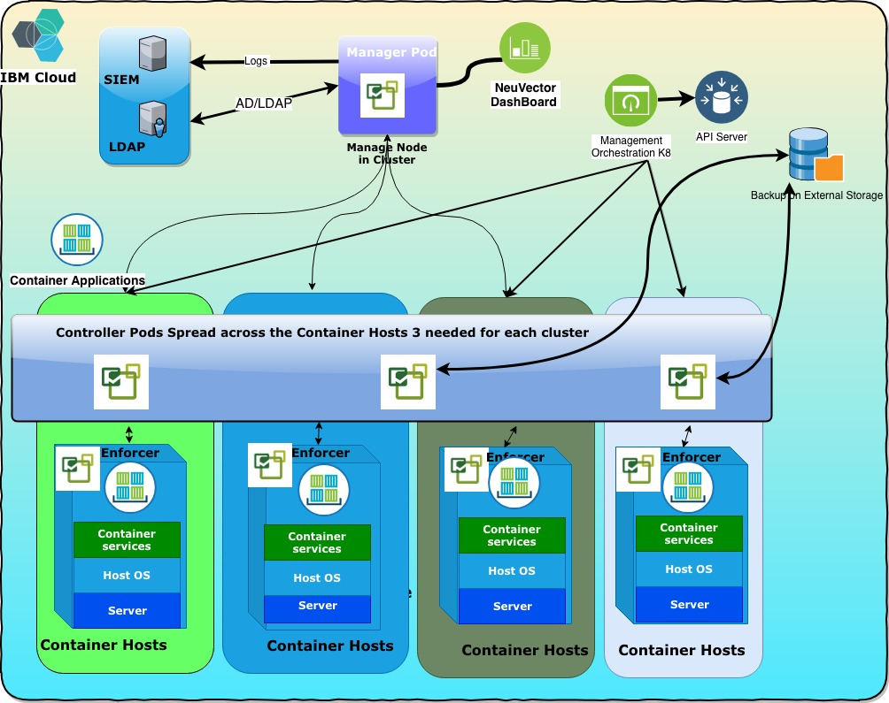
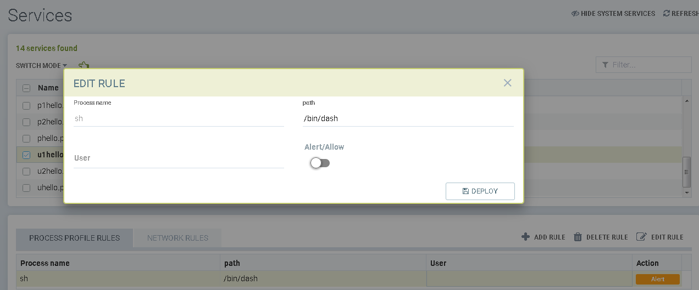
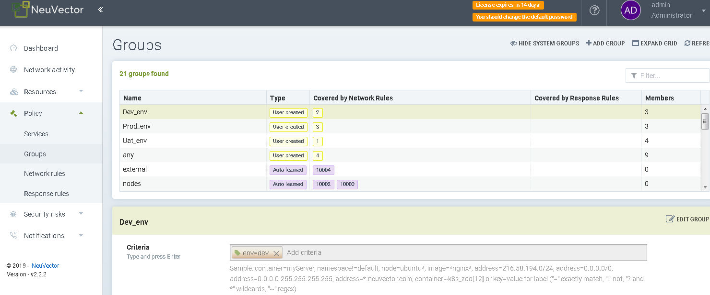

Authors: Aditya Gade/Dwarkanath P Rao

Document Owner: Dwarkanath P Rao

## 

# Security Overview

## Kubernetes Security

Orchestration tools such as Kubernetes and the management platforms
built

on top of it can be vulnerable to attacks if not protected.

In order to protect Kubernetes, we need to focus on four main areas for
to

review and configure for proper access controls.

1\. Protect the api server.

2\. Restrict kubelet permissions.

3\. Require authentication for all external ports.

4\. Limit or remove console access.

When combined with robust host security, the Kubernetes deployment
infrastructure can be protected from attacks. However, it is also
recommended that monitoring tools should be used to track access to
infrastructure services to detect unauthorized connection attempts

and potential attacks.

## Compliance for Kubernetes Environments

Container technology and tools such as Kubernetes, enterprises will be
constantly updating, upgrading, and migrating the container environment.
Running a set of security tests designed for Kubernetes environments
will ensure that security does not regress with each change.

● Host security

● Kubernetes security

● Docker daemon security

● Container security

● Properly configured RBACs

## Limitations which are exposed in K8.

#### API Server

The main function of the Kubernetes API server is to offer a REST API
for controlling Kubernetes. This is powerful—a user who has full
permissions on this API has the equivalent of root access on every
machine in the cluster.

The command-line tool **kubectl** is a client for this API, making
requests of the API server to manage resources and workloads. Any- one
who has write access to this Kubernetes API can control the

cluster in the same way.

By default, the API server will listen on what is rightfully called the
insecure port, port 8080. Any requests to this port bypass
authentication and authorization checks. If you leave this port open,
anyone who gains access to the host your master is running on has full
control over your entire cluster.

#### Kubelet

The kubelet is the agent on each node that is responsible for
interacting with the container runtime to launch pods, and report node
and pod status and metrics. Each kubelet in the cluster also operates

an API, through which other components ask it to do things like starting
and stopping pods. If unauthorized users can access this API (on any
node) to execute code on the cluster, it’s possible to gain control of
the entire cluster.

#### Running etcd Safely

Kubernetes stores configuration and state information in a distributed
key-value store called etcd. Anyone who can write to etcd can
effectively control your Kubernetes cluster. Even just reading the

contents of etcd could easily provide helpful hints to a would-be
attacker.

#### Kubernetes Dashboard

The Dashboard has been used by attackers to gain control of Kubernetes
clusters. It’s a powerful tool, and in older versions of Kubernetes, the
default settings made it easy to abuse; for example, prior to 1.7, the
Dashboard had full admin privileges by default.

## Securing container via firewall 

When you deploy a new container in your environment in production or
other environment in any location (Cloud, Private data centre), there
are a number of critical security areas to look for and understand, some
are very specific.

They are namely network filtering, container inspection, and host
Security, network inspection and securing the port and IP

Here are some approaches to secure a container via firewall

-   Layer 3/4 filtering, this is a on IP addresses and ports. in this
    approach Kubernetes network policy update rules dynamically, hence
    protecting deployments as they change and scale.

-   Web application firewall (WAF) attack detection can protect web
    facing containers (typically HTTP based applications) using methods
    that detect common attacks, similar to the functionality web
    application firewalls.

-   Layer-7 container firewall. A container firewall with Layer 7
    filtering and deep packet inspection of inter-pod traffic secures
    containers using network application protocols. Container firewalls
    are also integrated with orchestration tools such as Kubernetes and
    utilize behavioural learning for automated policy creation.
    Container firewalls also are in a unique position to Incorporate
    container process monitoring and host security into the threat
    vectors monitored.

-   Deep packet inspection (DPI) techniques are essential for in-depth
    network security in a container firewall.

-   Layer 7 DPI based inspection can look for and recognize these
    methods. Container firewalls using these techniques can determine
    whether each pod connection should be allowed to go through, or if
    they are a possible attack which should be blocked.

##  Container security challenges 

**New Container Threats** - steel sensitive private Data no protection
of the internal traffic and what’s going on inside of the container

**Cultural Challenges** - From the Developer View - Security and
Operations are not necessary anymore in the Devops Model - Get Security
Operations involved again with a DevOps Security Process

**Unexperienced in Security for container:** No experience about how to
operate a large Container Infrastructure Need for visibility for Ops and
Security

**Forward planning and technical Design authority**: Uncertain about how
dangerous Container Threats are and how they need to create their
Container Security Strategy Challenges with Audit Compliance Regulation

##  Securing through NeuVector

NeuVector is a security management and monitoring tool for Kuberentes,
docker which is widely used and implemented in the industry, this can be
deployed to a Kubernetes cluster using .yaml files or Helm charts.
NeuVector get deployed on each and every node in your Kubernetes cluster
– using its own namespace for each cluster. NeuVector is deployed on
every cluster that needs monitoring and management, this will control
all namespaces within a cluster under a single security policy. Access
to users can be restricted per namespace so that delegated
administration manages it effectively. Network rules can be created
based on groups which can refer to namespaces, in order to restrict
communication between namespaces.

NeuVector provides a powerful end-to-end container security platform.
This includes run-time protection for containers, pods and hosts,
including:

1.  Violation Protection. Discovers behaviour and creates a whitelist
    based policy to detect violations of normal behaviour.

2.  Threat Detection. Detects common application attacks such as DDoS
    and DNS attacks on containers.

3.  Vulnerability Scanning. Scans registries, images and running
    containers and hosts for common (CVE) as well as application
    specific vulnerabilities.

4.  Compliance & Auditing. Runs Docker Bench tests and Kubernetes CIS
    Benchmarks automatically.

5.  Endpoint/Host Security. Detects privilege escalations, monitors
    processes on hosts and within containers, and monitors container
    file systems for suspicious activity.

There are other important security features like the ability to
quarantine containers. It can be used for export logs through SYSLOG,
tickets can generated from this tool using webhooks, packet capture for
investigation, and integration with OpenShift RBACs, LDAP, Microsoft AD,
and SSO with SAML.

## Unique capabilities in NeuVector:

NeuVector provide interesting management and monitoring feature which
allows policies maker to adjust and implement the following.

1.  **Network Packet Inspection**

The ability to inspect all network traffic between containers within and
across hosts enables the following container protections:

• Application Layer Deep Packet Inspection. Protection based on
application protocols, not IPtables or L3/L4 data.

• Connection Blocking/Dropping. Block unauthorized connections without
affecting the container, letting authorized connections continue.

• Threat Prevention. Common application attacks such as DDoS and DNS
attacks are detected & prevented at the network.

• Container Packet Capture. Suspicious activity can be investigated by
capturing network sessions for those containers.

• Container Quarantine. Prevent ingress and egress on a container while
investigating.

**How does NeuVector handle:** Unique, patented network interception and
filtering does NOT require an agent, sidecar, or image modification

2.  **Auto-Learning & Scaling**

Container security must support rapid deployment of new applications and
constant updates, as well as scaling of containers up and down to meet
demand.

• Whitelist Rule Creation. Automated creation or programmatic
integration.

• Scale Up, Down, Across. No changes required as new containers with
different IPs on different hosts come and go.

• Add New Apps and Behaviours. Easily adapt to new and updated
behaviour.

**How does NeuVector handle:** Unique, patented behavioural learning
technology for policy creation and enforcement, plus network integration

3\. **Network & Orchestration Tool Integration**

Orchestration tools and network overlays make it difficult to keep
security policy updated and accurately enforcing rules.

• Network Compatible. Must maintain inspection and enforcement of rules.

• Orchestration/Platform Integration. Auto- update policy and accurately
visualize.

**How does NeuVector handle:** Integrates with popular orchestration
platform APIs such as Kubernetes, Docker EE, Rancher, EKS/ECS and
OpenShift; compatible/agnostic with Swarm, Weave, Flannel, Calico,
Cattle etc.

**4. Container Inspection**

The ability to monitor running containers helps determine if they could
be compromised.

• Run-time Vulnerability Scanning. Any container that starts running can
be scanned to determine vulnerabilities and assess risk of exploit.

• Process Inspection – Privilege Escalation Detection. Baseline and
monitor processes running within containers and detect privilege
escalation

• File System Monitoring – Detect suspicious file system activity in
containers

**How does NeuVector handle:** Auto-scans all running containers and
monitors processes for suspicious activity

**5. Host Security & Auditing**

If the host on which containers and the Docker daemon are running is
compromised all processes are at risk, so hosts must be monitored.

• Monitor Host Processes. Determine if a break out is about to occur.

• Detect Host Vulnerabilities. Detect critical vulnerabilities for
exploits such as the ‘Dirty Cow’ kernel attack.

• Evaluate Host Security Settings. Determine if host and Docker daemon
have appropriate security settings.

**How does NeuVector handle:** Detects privilege escalations, scans
hosts, and runs CIS Docker Benchmark & Kubernetes security audit

# NeuVector Security

This section will get into the details on NeuVector Architecture, Design
considerations, reference architecture on cloud and sizing.

## NeuVector Architecture

There are three components for neuVector deployment

Manager, Controller, Enforcer. Each of these have a role to play in
securing the environment.

Manager manages the cluster, Controller is deployed in cluster to
facilate the K8 security policies and set rules, and also help in
administering changes. Enforcer follows the set guidelines.

The hosting diagram for NeuVector is depicted as below.As we can see on
top of cluster(Kubernetes or other orchestration) it get deployed and
web can bee accessible through respected ports.

In below diagram the IBM cloud private(ICP) has been installed on linux
OS and based on configuration of ICP cluster NeuVector deployed.

NeuVector deployment require a namespace to be created and all its
configuration pods has to be created on same.

As mentioned earlier, manager,controller and enforcer deployed.

Based on role and access provided to that role manager can be accesible
and can be work on.

Figure 1 Deep Dive
NeuVector

### Controller

The Controller manages the NeuVector Enforcer container cluster. It
collects data from cluster of enforcers and send to manager through REST
API. It also provides REST APIs for the management console, registry
image scanning, and integration with external LDAP/MSAD/SAML and
Syslog/SIEM services. The typical test deployments have one Controller,
but in production multiple Controllers will be in a high-availability
and also load balanced configuration supported.

The controller requires 18300 (TCP) ,18301(TCP),
18302(UDP),18400(TCP),10443(TCP) to be configure while deploying
controller pods.

### Enforcer

The Enforcer is like agent which actually collects data from each node
and also enforces policies coming from controller to application pods.
The Enforcer is a lightweight container that enforces the security
policies and provides container and host vulnerability scanning.

One Enforcer is deployed on each node (host) as a daemon set to ensure
continuous monitoring and Enforcing throughout a Kubernetes cluster.

The Enforcer requires 18301(TCP/UDP), 18401(TCP) ports open to send and
receive data from controller. The Enforcer can also be useful for
traffic analyzation and system auditing.

### Updater

The Updater is a container which, when run, updates the CVE database for
NeuVector.

NeuVector regular publishes new Updater images to include the latest CVE
for vulnerability scans.

### Manager

The Manager is a container, and this is accessible a web-UI (HTTPS only)
and CLI console. We can configure more than one Manager Container can be
deployed as necessary in a environment and can be managed distinctively.
Multi manager deployment can be configured to manage many clusters in
any environment.

## NeuVector System Requirements

The following requirements must be met before deploying NeuVector:

-   Linux distributions: Ubuntu, CentOS/Red Hat Enterprise Linux,
    Debian, Rancher OS, CoreOS, SUSE.

-   Container management systems: native Docker, RedHat OpenShift,
    Docker Swarm, Docker UCP, Docker EE 2.0 Kubernetes, Rancher OS,
    Kubernetes, Google GKE/Kubernetes, Amazon AWS ECS and EKS, Microsoft
    Azure and AKS, IBM Cloud, SUSE CaaS, VMware Photon.

-   Minimum 1GB of memory for Controller, Manager or All-in-one
    container.

## NeuVector Network Requirements

-   Access to management UI at port 8443/tcp (configurable) of Manager
    pod at each cluster;

-   Access to Rest API at port 10443/tcp (configurable) of Controller
    pod at each cluster;

-   The Controller requires access to ports 18300, 18301, 18400, 18401;

-   The Enforcer requires access to ports 18301 and 18401;

-   Access to IAM via LDAP/LDAPS on ports 389 or 636 (configurable), or
    SAML (assumed https);

-   Access to SIEM via Syslog on port 514 (configurable, /tcp or /udp),
    Webhooks or API (assumed https);

-   Access to image repository for scanning (assumed https);

-   Connectivity between NeuVector modules inside Kubernetes clusters.

## NeuVector Deployment

NeuVector can be deployed to a Kubernetes cluster using .yaml files or
Helm charts.

Micro services communication requirements will be intra- and
inter-cluster as well as intra- and inter-namespace in some instances,
in addition to incoming and

outgoing external traffic. NeuVector shall be deployed to every node in
every Kubernetes

cluster. We can deploy NeuVector per cluster and will control all
namespaces within a Cluster under a single security policy. Access to
users can be restricted per namespace so

that delegated administration can be devised. Network rules can be
created based on groups which can refer to namespaces, in order to
restrict communication between

namespaces. Groups can also be used to define and control communication
to external resources.

## Deployment Scenarios 

There are three typical scenarios of NeuVector deployment as below:

1.  Single Site a single cluster deployment

2.  Single site multiple cluster deployment

3.  Multiple site multiple cluster deployment

### Single Site a single Cluster deployment

The diagram shows below single site single cluster deployment.

There are four main important components of NeuVector as explained
earlier Manager, controller, Enforcer, Updater.

The manager which is web UI deployment can be at anywhere and have API
connection with controller cluster. It will be access by administrator
and can do different tasks with respect to his role. We would need AD
authentication to get login into manager console.

There are three controller’s deployment across the nodes. We can deploy
controllers on different worker nodes in cluster or we can deploy on
management node by labelling and configuring in deployment yamls. The
controllers will receive and send information from and to enforcer
present in cluster. It also establishes API connectivity to manager.

The Enforcers are like agent sitting on worker nodes in cluster to
collect information and send to controller. In this scenario we will
have as many of enforcers as worker nodes. All enforcers can be deployed
using yaml from orchestration like Kuberentes on worker nodes.

Figure 2 NeuVector
Deployed across a simple cluster

### Single Site with multiple cluster deployment.

The scenario based on single site with multiple cluster as below.

The manager which is web UI deployment can be at anywhere and have API
connection with controllers per cluster. It will be access by
administrator and can do different tasks with respect to his role. We
would need AD authentication to get login into manager console. The
manager console are individual for each cluster.

The set of controllers has to be deployed on each cluster and integrated
with its manager by REST API.

Multiple controllers on each cluster can be deployed to achieve high
availability to avoid interruption.

The controllers also can be integrated different logging tool to collect
logs also to forward it further.

The enforcers deployed in worker nodes of every cluster forward and
receive information from that local controller cluster.

Figure 3 Single Site with
multiple cluster deployment.

### Multi-Site Multi-cluster deployment

Multi-site container security architecture is designed for the following
use case.

1.  There are large number of remote sites. Each site has a container
    deployment;

2.  Communication between applications of these sites are rare;

3.  Upstream network connection of each site has limited bandwidth.

The following diagram captures the proposed architecture.

Figure 4 Multiple Site
Multiple Cluster Deployment

Each box in the diagram represents a remote site cluster. There are
multiple container hosts running in each cluster. Each host has one
NeuVector enforcer deployed.

Multiple NeuVector controllers are deployed in each cluster to support
High Availability, so services are not interrupted, and security is not
compromised when container hosts fail or when controller upgrade is
needed.

NeuVector managers can be created on demand to manage controllers
running in the remote cluster.

There are several advantages about this architecture,

-   High scalability - controllers only manage the local container
    cluster of each site. Large number of remote clusters are supported.

-   Minimal overhead added to the remote cluster's upstream network
    connection, because only the management messages and filtered log
    reports use the connection.

-   High availability in each remote cluster.

-   Controllers expose REST APIs. They can be used by the manager or
    other software to

-   Manage remote sites' security policies.

-   Communications between managers and the remote sites are secured.

-   Managers can be created on demand to reduce attack surfaces.

## Updating CVE Database

### Updating the NeuVector CVE Vulnerability Database

A container called the Updater is published and regularly updated on
NeuVector’s Docker Hub. This image can be pulled, and when run it will
update the CVE database used to scan for vulnerabilities.

The updater will update the NeuVector CVE database, then stop the
container. You may need to pull the latest updater image from the
NeuVector docker hub into your private registry to have the newest
update available to run.

### Manual Updates

Below is an example for manually updating the CVE database.

Run the updater file below

kubectl create -f &lt;updater.yaml&gt;

## Configuration and backup

NeuVector supports persistent data for the NeuVector policy and
configuration. This configures a real-time backup to mount a volume at
/var/neuvector/. When the persistent volume is mounted, the
configuration and policy are stored during run-time to the persistent
volume. In the case of total failure of the cluster, the configuration
is automatically restored when the new cluster is created. Configuration
and policy can also be manually restored or removed from the
/var/neuvector/ volume.

The default for saving backup configuration files to a mapped volume is
changed from On to Off. Also, starting the controller does not try to
automatically pull the backup configuration from the mounted volume.

Figure 29 NeuVector
backup

## Encryption and security:

NeuVector does not support encryption in rest or encryption in transit.
In future in updated versions it is going integrate with service mesh
(ISTIO) and can provide encryption.

## Sizing Reference

<table>
<thead>
<tr class="header">
<th>S.No</th>
<th>Description</th>
</tr>
</thead>
<tbody>
<tr class="odd">
<td>Manager</td>
<td>
Can be installed on Worker Node or on any of Management components where K8 is installed.

Minimum 2 GB memory on O.S

Should be accessible to all the K8 Clusters environment. ( on the same network which you want to manage)
</td>
</tr>
<tr class="even">
<td>Controller</td>
<td>
Installed in K8 cluster in a pair of 3 controller in that cluster, need minimum 3 worker nodes to have complete Controller cluster Installed.

Minimum Memory recommendation is 1GB on OS where K8 is installed
</td>
</tr>
<tr class="odd">
<td>Enforcer</td>
<td>This get default installed on all cluster node managed by NeuVector as daemon Set. Minimum 1 GB memory on hosts</td>
</tr>
</tbody>
</table>

# NeuVector operational model

Figure 5 NeuVector
Component Model

## NeuVector Controller

Deployments have one Controller or multiple Controllers in a
high-availability with load balance configured. It provides REST APIs
for the management console and pushes all the policy over REST API to
the enforcer.

## NeuVector Manager

The Manager is a container that provides a web-UI (HTTPS only) and CLI
console for users to manage the NeuVector security solution. More than
one Manager Container can be deployed as necessary.

## Enforcer

The Enforcer is a lightweight container that enforces the security
policies. One enforcer should be deployed on each node (host).

The Enforcer container and the Controller cannot be deployed on the same
node (except in the All-in-One case below).

## SYSLOG / SIEM Services

An SIEM or simple syslog on a windows machine can be used for event
forwarding.

## Vulnerability Analyser

Prevent vulnerable images from being deployed and scan running
containers and hosts.

## Security compliance 

NeuVector also automatically runs the Docker Bench security report and
Kubernetes CIS Benchmark (if applicable) on each host and running
containers.

## Network Policy

NeuVector maintains a security Policy which can be managed from the GUI,
CLI, or REST API.

A list of whitelist and blacklist rules for NeuVector to enforce.
NeuVector can auto-discover and create a set of whitelist rules while in
Discover mode. Rules can be added manually if desired.

NeuVector automatically creates Layer 7 (application layer) whitelist
rules when in Discover mode, by observing the network connections and
creating rules which enforce application protocols.

## Register scanning

The Registry Scan feature allows to scan the images on public and
private docker registries that are based on Native Docker, Amazon ECR,
Redhat/Openshift, jFrog, Microsoft ACR, Sonatype Nexus and Google cloud
registry. The scan report for the image comprises of the vulnerability
status of various packages and binaries in the image.

## LDAP/MSAD/SAML

NeuVector provides a number of ways to integrate, including a REST API,
CLI, SYSLOG, RBACs, SAML, LDAP, and webhooks.

# NeuVector Console components

## Accessing NeuVector Dashboard

## How to access NeuVector User Interface independent

Open a browser window, connect to the manager or all-in-one container's
host IP on default port 8443 using HTTPS. After accepting the EULA, the
user is able to access the UI.

Figure 6 NeuVector User
Interface Dashboard

## How to access through CLI

On the same host where the manager or controller container is running,
issue the following command line,

\# docker exec -it &lt;manager\_container\_name&gt; cli

\# kubectl exec -it &lt;controller-pod&gt; cli

## Dashboard:

The Dashboard consist of critical security events,vulnerability
containers, and total number of containers has been deployed in cluster.

It is front view of all incidents and violations by nodes or pods in
cluster environment. It also shows top incidents,vulnerable containers
or nodes,violations or threats if available.

Figure 7 NeuVector
Dashboard

Users can access the portal and dashboard once they are integrated with
LDAP/AD and the privileges are granted in AD/LDAP. Normally there are
Admins/Viewer, Guest. But we can create more as needed.

Figure 8 NeuVector
Primary Console

## Network Activity: 

Network activity gives us traffic behaviour of pods deployed in cluster
environment.

Depends on different modes we can find different colour of pods. The
blue lines show normal network conversations with directions. Red lines
show any violation, risks.

If we click on any line, we can see port, bytes, protocol, and action
information. So, we can get this all between each pod communication.

The source to destination flow information diagram depicted below.

Based on conversation, traffic flow activity and network policies live
scenarios can be seen and monitor.

Figure 9 NeuVector
Network activity

The activity of pod network can be monitor from manger Ui as shown
above.

We can monitor connectivity between pod to pod, host to host, ingress
controllers to pods and also connectivity to external network.

As soon as you deploy applications pods it will start updating this pane
and we can see different network connection of that pod in any pod
Network modes (explained in network mode section).

Based on rules created we can see different colours of arrows between
pods or hosts and abbreviation of that can been seen at left corner. i.e
If we block external connection from any pod we can see red arrow from
external network to that pod if any one tried to access that pod
externally.

Figure 10 NeuVector
Network Maps Layout

If we click on one of arrow, we can see client /server IP, protocol name
and port, number of bytes, and also network rule which is associated
with that traffic flow.

Figure 11 NeuVector
Network Maps Layout with Ports

If you move cursor around map and point out any particular symbol, we
can get information of that pod or node like name, namespace, service
etc.

If we right click on pod, we can get different options to do changes in
modes, collapse namespaces, quarantine, packet capture etc. If we keep
live update enable while capturing traffic, we can monitor live traffic
bytes in troubleshooting. As shown below.

Figure 14 NeuVector Network Maps Layout with different options

### Resources:

#### Containers

Container tab display number of pods or containers has been deployed
with other information like namespace, node name, application image,
state etc.

If we select any container and scroll down, we can see Container
details, Container stats, and process running inside container.

Figure 12 NeuVector
Container Maps

#### Container Details:

Figure 13 Deep Dive in
Containers

#### Container Stats:

Figure 14 Container
Status

#### Container Process:

Figure 15 Container
Process from NeuVector

### Nodes:

The number of hosts on which cluster has been configured shown in nodes
tab.

It also gives nodes complete information like OS details, CPU, memory
etc.

By selecting one of node we can get other information like kernel
version, number of containers and Docker version.

It also depicts list of containers deployed on that node.

Figure 16 NeuVector Nodes
details

### Controllers: 

The controllers are main component of NeuVector architecture. We can see
controller’s information and health in controllers tab in left pane.

For POC we did install only one controller pod which can collect
information from enforcers on worker node as shown below.

The deployment in production of controller will be in HA so max 3
controller must be deploy and leader from them can be seen in web UI.

Figure 17 NeuVector
Controller description

### Enforcers:

Enforcers are like agents sitting on each worker node to collect runtime
information of containers and deploy polices defined by controllers.

As many numbers of nodes we increase, Enforcer start deploying on them
from controller. It is demon set present on nodes.

The enforcers we can see in web UI and also we can get each enforcer
details like node name, IP, Version etc. The stats also available to
monitor their health.

Figure 18 Enforcers

### Policy:

#### Services:

This provides the primary view of services to set the mode (Discover,
Monitor, Protect) for each service. These are automatically created by
NeuVector when containers begin running.

The Services menu also is where Process Profile Rules are managed.

###  Process profile Rules:

NeuVector has built-in detection of suspicious processes as well as a
baselining technology for containers. Built-in detection includes
processes such as port scanning (e.g. NMAP), reverse shell, and even
privilege escalations to root. Each service discovered by NeuVector will
create a baseline of ‘normal’ process behaviour for that container
service. These rules can be customized if desired.

Process rules can be viewed and managed in Run-Time Security Policy
-&gt; Services -&gt; Process Profile Rules. A process is uniquely
identified by its name, path and user. NeuVector does not perform any
active killing of processes, which could have an adverse effect on the
orchestration platform policies. Instead, alerts and notifications are
generated. Process Profile Rules can be added, edited, and deleted and
can be either whitelist (allow) or blacklist (alert). Wildcards for the
process path and user are supported.

Figure 19 Profile Rules

###  NeuVector Modes:

The NeuVector Violation Detection module has three modes: Discover,
Monitor, and Protect. At any point in time, any Service can be in any of
these modes.

####  Discover:

NeuVector starts in Discover mode.

In this mode, NeuVector: Discovers your container infrastructure,
including containers, nodes, and hosts. Learns your applications and
behaviours by observing conversations (network connections) between
containers. Identifies separate services and applications running.

Automatically builds Network Rules in Policy.

#### Monitor

In Monitor mode NeuVector monitors conversations and detects run-time
violations of your Security Policy. In this mode, no new rules are
created by NeuVector, but rules can manually be added at any time.

When violations are detected, they are visible in the Network Activity
map visually by a red line. Violations are also logged and displayed in
the Notifications tab. Process profile rule violations are logged into
Notifications -&gt; Incidents.

In the Network map you can click on any arrow (green, yellow, red line)
to display more details about the type of connection and protocol last
monitored. You can also use the Search and Filter by Group buttons in
the lower right display of your containers.

#### Protect

In Protect mode, NeuVector enforcers will block (deny) any network
violations and attacks detected. Violations are shown in the Network map
with a red ‘x’ in them, meaning they have been blocked.

####  Switching Between Modes

You can easily switch NeuVector Services from one mode to another. In
Discover mode, NeuVector is building a Security Policy for allowed,
normal container behaviour. You can see these rules in the Policy -&gt;
Services tab or in detail in the Policy -&gt; Network Rules menu.

When you switch from Discover to monitor mode, NeuVector will flag all
violations of normal behaviour not explicitly allowed. Because NeuVector
enforces policy based on applications and groups with similar
attributes.

Before deploying new updates that result in new types of connections
between containers, you switch the affected Service(s) to discover mode
to learn these new behaviours. Alternatively, you can manually add new
rules while in any mode.

### Groups

The Groups which are discovered in Discover mode can be seen in Groups
tab.

The discovered groups can be identify by ‘Auto learned’ in type.

We can create custom groups (identify as User created) depends on
different criteria and lower pane.

This groups are very important for creating policy: network rules, as
while rule creating we will be selecting this groups in from and to
section.

Based on criteria in group we can check members of that group in right
pane as shown below.

Figure 20 Setting and
configuring Groups

### Policy: Network Rules

NeuVector automatically creates Network Rules from running applications
in Discover mode. You can also manually add them in any mode, Discover,
Monitor, or Protect. Rules can be added or edited from the CLI or REST
API.

NeuVector analyses and protects based on not only IP address and port,
but by determining the actual network behaviour based on application
protocols. This enables NeuVector to automatically protect any new
application containers regardless of IP address and port.

Network rules specify ALLOWED or DENIED behaviour for your applications.
These rules determine what connections are normal behaviour for your
services as well as what are violations. You can delete automatically
‘learned’ rules as well as add new rules to your policy.

Network rules are enforced in the order that they appear in the list,
from top to bottom. To change the order of rules, drag and drop them to
a new place in your list.

### How to add rule:

Figure 21 Defining your
own Rules in NeuVector

**ID**

(Optional) Enter a number. Network rules are initially ordered from
lowest to highest, but rule order can be changed by dragging and
dropping them in the list.

From

Specify the GROUP from where the connection will originate. Start typing
and NeuVector will match any previously discovered groups, as well as
any user created groups.

**To**

Specify the destination GROUP where these connections are allowed or
denied.

Applications

Enter applications for NeuVector to allow or deny. NeuVector understands
deep application behaviour and will analyse the payload to determine
application protocols.

**Ports**

If there are specific ports to limit this rule to, enter them here.

If Deny is selected, NeuVector will log this as a violation while in
Monitor mode, and will block this while in Protect mode. The default
action is to Deny a connection (log violation only if in Monitor mode)
if no rule matches it.

Figure 22 Configuring
network Policies

### Policy: Response Rules

Response Rules provide a flexible, customizable rule engine to automate
responses to important security events. Triggers ca include Threats,
Violations, Incidents, Vulnerability Scan results, CIS Benchmarks, and
general Events. Actions include container quarantine, web hooks, and
suppression of alerts.

Creating a new Response Rule using the following:

-   Group. A rule will apply to a Group. Please see the section Run-Time
    Security Policy -&gt; Groups for more details on Groups and how to
    create a new one if needed.

-   Category. This is the type of security event, such as Threat, or CVE
    vulnerability scan result.

-   Criteria. Specify one or more criteria. Each Category will have
    different criteria which can be applied. For example, by the event
    name, severity, or minimum number of high CVEs.

-   Action. Select one or more actions. Quarantine will block all
    network traffic in/out of a container. Webhook requires that a
    webhook endpoint be defined in Settings -&gt; Configuration.
    Suppress log will prevent this event from being logged in
    Notifications.

All Response Rules are evaluated to determine if they match the
condition/criteria. If there are multiple rule matches, each action(s)
will be performed. This is different than the behaviour of Network
Rules, which are evaluated from top to bottom and only the first rule
which matches will be executed.

## Policy Implementation based on different scenario

Let us consider three different scenarios prod, uat and dev .

Created one namespace ( policy-demo) with this same name and deploy pods
with same labels in this namespace.

Connectivity between same label pods

We will create three different rules for same labels as we want pods
with same labels should communicate with each other.

In <u>policy&gt;services</u> wecreated three different groups adding
criteria as env=uat,env=dev,env=prod.

Now,<u>policy&gt;Network rules&gt;Insert top</u> create rule mentioning
souce and destination respected groups ,mention ports and also provide
action.

Click on deploy and save rule. Policy will be deployed you will able to
see rules in list with proper rule id.

After rule implementation go to node console and login to one of the pod
and check connectivity as shown below.

We can also see the exact traffic flow and direction in network activity
as explained in console component section.

Blocking traffic between different labeled pods

As we don’t have default deny rule created the traffic between different
label pods are also reachable and can be accesible.

In our second scenario we block traffic for different labels.

For blocking traffic we need to create:

Individual rule for every label. Default rule at bottom of list
mentioning source, destination, ports as any and action as deny.

Figure 23 Network Rules

We created both and tested from uat pod to prod pod. We can see in
above, traffic is blocking.

Now, let’s test other way to access pod by doing wget. We deployed nginx
pod with uat label and get that added into uat group. Logged in into
prod pod and did wget nginx pod on port 80.The connection got blocked as
we can see below.

So, all this blocking possible because of default deny rule has been
added in bottom of list.

NeuVector rules basically works on top to bottom priority. Therefore
position of rule is more important than rule id.If we keep this default
rule at top it will block all traffic (if all services are in protect
mode)

# Understanding Security in NeuVector

## Integrating with AD/LDAP

NeuVector provides an internal user management to create users based on
two distinct

Roles: Administrator and View only. In addition, authentication and
authorization can be

Integrated with either LDAP or Microsoft Active Directory. Single
sign-on via SAML is also

Supported by NeuVector.

Configure the required fields to connect to your LDAP server.

Figure 24 Configuring to
LDAP

Port. The default port is 389 for SSL disabled and 636 for SSL enabled.

User name (optional). We use this admin user name to bind the ldap
server for each query.

Base dn. This should be a root node in ldap server to search for the
ldap user and group.

### Autherisation with AD and Role access

Default role: This role that a user will take if role group mapping
(below) fails. If the user’s group attribute is found that can be mapped
to a role, then the default role will not be used. If no matching group
attribute is found, the default role will be taken. The ‘test
connection’ button will check if a username/password can be
authenticated by the configured LDAP server.

Admin and Reader role map. This defines how to map a user’s LDAP group
membership to the user role in NeuVector. Add the LDAP group list to the
corresponding roles.

Figure 25 Configuration
LDAP and AD

Kubernetes Administrator

The kubernetes administrator can access NeuVector dashboard and monitor
network activity also can monitor risks and vulnerabilities. Access to
this role will be read-only to NeuVector.

Security Administrator

The Security Administrator role will have full access to NeuVector UI.It
can access to all features and make changes which will directly make
effect on cluster. It can also create different policies and change
service groups in order to change different network and firewall
settings.

## Syslog Integration

Enter the SYSLOG server IP and select the level of notification. You can
also use a DNS name and/or select TCP for configuration.

Figure 26 Integration. to
SysLog

## Working with Manager

The Manager is a container that provides a web-UI (HTTP or HTTPS,

configurable) and CLI console for users to manage the NeuVector security

solution.

The Manager is only connected to the Controller over the REST API.
Therefore,

the Manager can also be deployed outside the production cluster.

More than one Manager container can be deployed if necessary.

## Working with run Time Security in Cluster

To detect Violations of normal behaviour, NeuVector maintains a security
Policy which can be managed from the GUI, CLI, or REST API.

Services

This provides the primary view of services to set the mode (Discover,
Monitor, and Protect) for each service. These are automatically created
by NeuVector when containers begin running. The Services menu also is
where Process Profile Rules are managed.

Process Profile Rules

NeuVector has built-in detection of suspicious processes as well as a
baselining technology for containers. Built-in detection includes
processes such as port scanning (e.g. NMAP), reverse shell, and even
privilege escalations to root. Each service discovered by NeuVector will
create a baseline of ‘normal’ process behaviour for that container
service. These rules can be customized if desired.

Groups

Network and Response Rules in NeuVector are created using a ‘from’ and
‘to’ field, which requires a Group as input. A group can be an
application, derived from image labels, DNS name or other customized
grouping.

Network Rules

A list of rules for NeuVector to enforce. NeuVector can auto-discover
and create a set of rules while in Discover mode. Rules can be added
manually if desired.

NeuVector automatically creates Layer 7 (application layer) whitelist
rules when in Discover mode, by observing the network connections and
creating rules which enforce application protocols.

Response Rules

Response Rules enable users to define actions to respond to security
events. Events include Threats, Violations, Incidents, and Vulnerability
Scan results. Actions include container quarantine, web hooks, and
suppression of alerts.

File Systems Rules

NeuVector has built-in detection of suspicious file system activity. Any
suspicious activity detected will be logged into Notifications -&gt;
Incidents.

## Registry Scan and action

NeuVector supports a complete vulnerability management workflow for
ensuring that vulnerable containers do not get deployed to registries or
production. You can easily integrate the NeuVector vulnerability scanner
into your CI/CD pipeline to scan during the Build, Ship and Run phases.

Major features include:

-   Registry scanning including filtering of repositories monitored

-   Automated run-time scanning of all running containers

-   Automated run-time scanning of all hosts in a cluster

-   Automated run-time scanning of the orchestration platform (e.g.
    Kubernetes)

-   Sample automation scripts to trigger image scans using the REST API
    and CLI

-   Notifications and downloadable reports

-   Automated response rules to quarantine, notify, or suppress
    notifications based on vulnerability criteria

Registry scanning requires that the NeuVector Controller container be
deployed on a host/node. Please see the Installation/Deployment section
for how to deploy the NeuVector container. Configure registry scanning
from the NeuVector console after logging in to the manager.

To configure registries and repositories to be scanning, go to the
Security Risks -&gt; Registry Scan menu in the NeuVector console. Add or
edit registries to be scanned. Use the Filter to define repositories or
subsets of images to be scanned.

Figure 27 Registry Scan

The registry will be scanned according to a schedule, which is
configurable. By default, only new or updated images will be scanned. If
you want to scan all applicable images including those which have
already been scanned, select the Rescan scanned images button when
configuring the registry.

After the scan is completed click on the repository/tag to see
vulnerabilities and click on the vulnerability to see more info. You can
also download the report in a CSV file or see the results in the Event
logs.

#### Run-Time Scanning

NeuVector can scan running containers and host nodes for
vulnerabilities. In the Security Risks -&gt; Vulnerabilities menu enable
Auto-Scan to scan all running containers and nodes, including newly
started ones once they start running. You can also select a container or
node and scan it manually.

You can click on each vulnerability name/CVE that is discovered to
retrieve a description of it, and click on the inspect arrow in the
popup to see the detailed description of the vulnerability.

## Compliance ,management and Reporting

### Compliance check based on CIS Benchmark 

NeuVector also automatically runs the Docker Bench security report and
Kubernetes CIS Benchmark on each host and running containers. The
results can be viewed in the window to the right after the report
becomes available.

You can download a csv report of the test results, as well as rerun the
benchmark manually or with the CLI/REST API. A remediation field is
provided for convenience.

Figure 28 CIS BenchMark
All Policies listed here

# Deployment of NeuVector on Kuberentes on AWS EC2 instances

There are three NeuVector containers, the controller, manager, and
enforcer. Each can be deployed separately.

The enforcer should be deployed on every host/node where application
containers to be monitored and protected by NeuVector will be running.

The controller manages the cluster of enforcers and can be deployed on
the same node as an enforcer or on a separate management node. The
manager should be deployed on the node where the controller is running
and will provide console access to the controller.

NeuVector requires and supports Kubernetes network plugins such as
flannel, weave, or calico.

-   Create the NeuVector namespace

-   Configure Kubernetes to pull from the private NeuVector registry on
    Docker Hub

-   Add read permission to access the Kuberentes API

-   Create the NeuVector services and pods.

### Create the NeuVector namespace

### Configure Kubernetes to pull from the private NeuVector registry on Docker Hub

Add read permission to access the kubernetes API

Create the neuvector services and pods.

